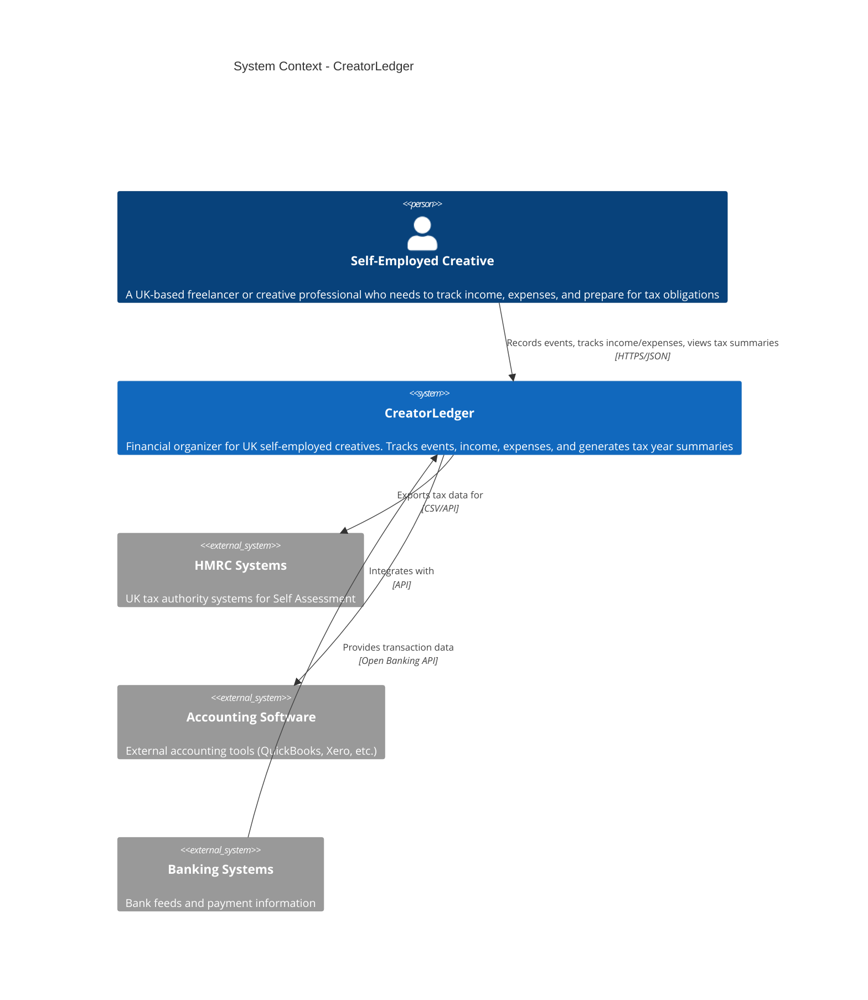

# System Context Diagram

Shows CreatorLedger in its environment, including users and external systems.

## Key Elements

### Users
- **Self-Employed Creative**: Primary user who needs simple, UK-focused financial tracking

### CreatorLedger System
- Tracks events (gigs, projects, commissions)
- Records income and expenses
- Categorizes expenses by HMRC-recognized categories
- Generates tax year summaries (April to April)
- Calculates profit/loss

### External Systems
- **HMRC Systems**: Tax data export for Self Assessment
- **Accounting Software**: Integration with professional accounting tools (future)
- **Banking Systems**: Automatic transaction import via Open Banking (future)

## Design Decisions

1. **UK-Focused**: Tax year logic specific to UK (April 6 - April 5)
2. **Self-Contained**: Core functionality works standalone without external dependencies
3. **Integration-Ready**: Designed for future integrations (marked as future in diagram)

## Evolution

- ✅ **Phase 1 (Current)**: Standalone system with manual data entry
- 📋 **Phase 2 (Planned)**: Open Banking integration for automatic transaction import
- 📋 **Phase 3 (Planned)**: HMRC API integration for direct tax submission
- 📋 **Phase 4 (Planned)**: Accounting software integrations
