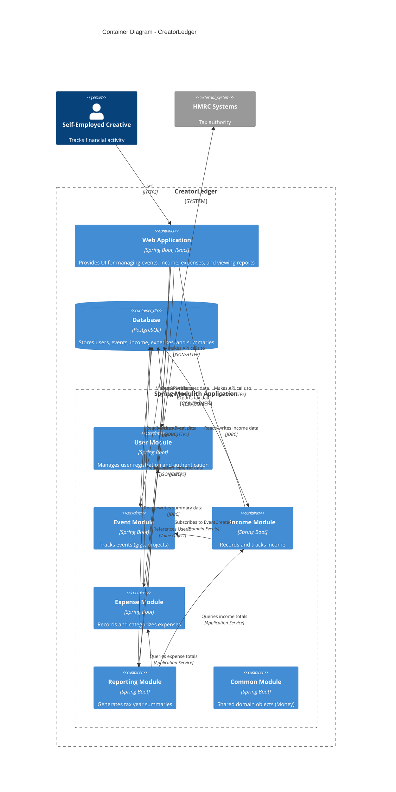

# Container Diagram

Shows the high-level architecture of CreatorLedger using Spring Modulith.

## Key Containers

### Web Application (Future)
- **Technology**: Spring Boot + React
- **Purpose**: User interface for all functionality
- **Status**: Not yet implemented

### Spring Modulith Application (Current)
A modular monolith containing 6 bounded contexts:

1. **User Module** ✅ Implemented
   - User registration and management
   - REST API: `/api/users`

2. **Event Module** ✅ Domain implemented
   - Event tracking (gigs, projects, commissions)
   - Links income to specific events

3. **Income Module** ✅ Domain implemented
   - Income recording and payment tracking
   - Payment statuses (PENDING, PAID, OVERDUE, CANCELLED)

4. **Expense Module** ✅ Domain implemented
   - Expense recording and categorization
   - HMRC-aligned categories

5. **Reporting Module** ✅ Domain implemented
   - Tax year summary generation
   - Profit/loss calculations
   - Category breakdowns

6. **Common Module** ✅ Implemented
   - Shared domain objects (Money)
   - Cross-cutting concerns

### Database
- **Technology**: PostgreSQL 16
- **Purpose**: Persistent storage for all aggregates
- **Status**: JPA entities and repositories implemented for User module

## Module Communication

### Domain Events
Modules communicate asynchronously via domain events:
- `UserRegistered` - Published by User module
- `EventCreated` - Published by Event module
- `IncomeRecorded` - Published by Income module
- `ExpenseRecorded` - Published by Expense module
- `TaxYearSummaryGenerated` - Published by Reporting module

### Application Services
Reporting module queries other modules via application services to aggregate data.

### Value Object Sharing
Common module provides shared value objects (Money, UserId, etc.).

## Technology Stack

- **Framework**: Spring Boot 4.0
- **Modulith**: Spring Modulith 1.2.4
- **Language**: Java 21
- **Database**: PostgreSQL 16
- **ORM**: Spring Data JPA / Hibernate
- **Testing**: Spock (Groovy), Testcontainers
- **Build**: Gradle 9.2

## Deployment

- **Current**: Single JAR deployment (modular monolith)
- **Future**: Could split into microservices if needed (Spring Modulith supports this)
- **Target**: Oracle Cloud Infrastructure (Docker container)

## Architecture Patterns

- **Hexagonal Architecture**: Each module follows ports & adapters
- **Domain-Driven Design**: Clear bounded contexts with aggregates, entities, value objects
- **Event-Driven**: Asynchronous communication via domain events
- **CQRS-lite**: Separation of commands and queries (not full CQRS)
