# Component Diagram - [MODULE_NAME] Module

Shows the internal components of the [MODULE_NAME] module following hexagonal architecture.

```mermaid
C4Component
    title Component Diagram - [MODULE_NAME] Module

    Person(creator, "Creative User", "Uses the system")

    Container_Boundary(moduleNameModule, "[MODULE_NAME] Module") {
        Component(controller, "[ModuleName]Controller", "Spring REST Controller", "Provides REST API endpoints")
        Component(requestDto, "Request DTOs", "DTOs", "Request objects for API")
        Component(responseDto, "Response DTOs", "DTOs", "Response objects for API")

        Component(appService, "[ModuleName]ApplicationService", "Application Service", "Orchestrates use cases")
        Component(commands, "Command Objects", "Commands", "Encapsulate intent")
        Component(repositoryPort, "[ModuleName]Repository", "Port Interface", "Repository contract")

        Component(aggregate, "[AggregateName]", "Aggregate Root", "Core domain entity")
        Component(valueObjects, "Value Objects", "Value Objects", "Immutable domain concepts")
        Component(domainEvents, "Domain Events", "Events", "Published events")

        Component(jpaRepository, "Jpa[ModuleName]Repository", "Adapter", "JPA implementation")
        Component(jpaEntity, "[ModuleName]JpaEntity", "JPA Entity", "Persistence entity")
        Component(mapper, "[ModuleName]EntityMapper", "Mapper", "Domain ↔ JPA conversion")
        Component(springDataRepo, "SpringData[ModuleName]Repository", "Spring Data JPA", "Auto-generated")
    }

    ContainerDb(database, "PostgreSQL", "Database", "Stores [module] data")

    Rel(creator, controller, "Makes API calls", "HTTPS/JSON")
    Rel(controller, requestDto, "Receives")
    Rel(controller, responseDto, "Returns")
    Rel(controller, appService, "Calls")

    Rel(appService, commands, "Creates")
    Rel(appService, repositoryPort, "Uses")
    Rel(appService, aggregate, "Manipulates")

    Rel(aggregate, valueObjects, "Contains")
    Rel(aggregate, domainEvents, "Publishes")

    Rel(repositoryPort, jpaRepository, "Implemented by")
    Rel(jpaRepository, mapper, "Uses")
    Rel(jpaRepository, springDataRepo, "Delegates to")

    Rel(mapper, aggregate, "Converts to/from")
    Rel(mapper, jpaEntity, "Converts to/from")

    Rel(springDataRepo, database, "Reads/writes", "JDBC")
    Rel(springDataRepo, jpaEntity, "Persists")
```



## Component Layers

### Presentation Layer (Infrastructure/Web)
**Purpose**: HTTP interface

- **[ModuleName]Controller**: REST controller
  - [List endpoints]

- **Request/Response DTOs**: [List DTOs]

**Tests**: [X] unit tests

### Application Layer
**Purpose**: Use case orchestration

- **[ModuleName]ApplicationService**: Coordinates operations
  - [List methods]

- **Command Objects**: [List commands]
- **[ModuleName]Repository** (Port): Persistence contract

**Tests**: [X] unit tests (with mocked repository)

### Domain Layer
**Purpose**: Business logic

- **[AggregateName]** (Aggregate Root): [Description]
  - [List key methods and business rules]

- **Value Objects**: [List value objects and their purposes]
- **Domain Events**: [List events]

**Tests**: [X] unit tests (pure domain logic)

### Infrastructure Layer (Persistence)
**Purpose**: Technical persistence

- **Jpa[ModuleName]Repository** (Adapter): Implements repository port
- **[ModuleName]JpaEntity**: JPA entity for database
- **[ModuleName]EntityMapper**: Bidirectional conversion
- **SpringData[ModuleName]Repository**: Spring Data interface

**Tests**: [X] tests (unit + integration)

## Key Workflows

### [Workflow 1 Name]
```
[Describe the flow from HTTP request through domain to persistence]
```

### [Workflow 2 Name]
```
[Describe another key workflow]
```

## Design Patterns

- **Hexagonal Architecture**: Ports & Adapters
- **Repository Pattern**: Abstracts persistence
- **[Other patterns used]**

## Module Boundaries

### Public API (Exposed)
- REST endpoints: `/api/[module]/**`
- Domain events: [List events]
- Value objects: [List shared VOs]

### Private (Hidden)
- Application service details
- Repository implementations
- JPA entities

## Test Strategy

| Layer | Test Type | Count |
|-------|-----------|-------|
| Domain | Unit | [X] |
| Application | Unit | [X] |
| Infrastructure | Unit + Integration | [X] |
| Web | Unit | [X] |

**Total**: [X] tests

## Evolution

- ✅ **Current**: [What's implemented]
- 📋 **Next**: [Next steps]
- 📋 **Future**: [Future plans]
