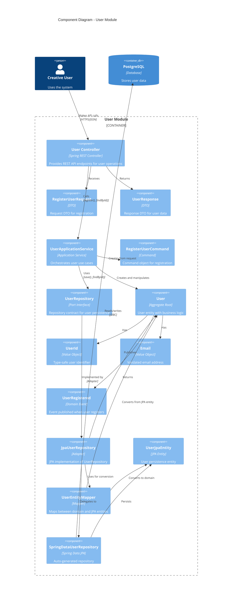

# Component Diagram - User Module

Shows the internal components of the User module following hexagonal architecture.



## Component Layers

### Presentation Layer (Infrastructure/Web)
**Purpose**: HTTP interface for external clients

- **UserController**: REST controller exposing `/api/users` endpoints
  - POST `/api/users` - Register user
  - GET `/api/users/{id}` - Get user by ID
  - GET `/api/users/{id}/exists` - Check existence

- **RegisterUserRequest**: Input DTO for registration requests
- **UserResponse**: Output DTO for user data

**Tests**: 15 unit tests (DTOs + controller)

### Application Layer
**Purpose**: Use case orchestration and coordination

- **UserApplicationService**: Coordinates user operations
  - `register(RegisterUserCommand)`: Creates and saves new user
  - `findById(UserId)`: Retrieves user
  - `existsById(UserId)`: Checks existence

- **RegisterUserCommand**: Command object encapsulating registration intent
- **UserRepository** (Port): Interface defining persistence contract

**Tests**: 14 unit tests (with mocked repository)

### Domain Layer
**Purpose**: Business logic and domain rules

- **User** (Aggregate Root): Core user entity
  - Static factory: `register(Email)` or `register(UserId, Email)`
  - Immutable record
  - Entity equality based on ID

- **UserId**: Type-safe UUID wrapper
- **Email**: Validated email value object (regex, lowercase normalization)
- **UserRegistered**: Domain event for cross-module communication

**Tests**: 7 unit tests (pure domain logic)

### Infrastructure Layer (Persistence)
**Purpose**: Technical implementation of persistence

- **JpaUserRepository** (Adapter): Implements UserRepository port
  - Converts between domain and JPA entities
  - Delegates to Spring Data repository

- **UserJpaEntity**: JPA-annotated entity for database persistence
- **UserEntityMapper**: Bidirectional conversion (domain ↔ JPA)
- **SpringDataUserRepository**: Spring Data JPA interface (auto-implemented)

**Tests**: 11 tests (5 mapper unit tests + 6 integration tests)

## Hexagonal Architecture (Ports & Adapters)

### Ports (Interfaces)
- **UserRepository**: Persistence port defined in application layer

### Adapters (Implementations)
- **JpaUserRepository**: Persistence adapter using JPA
- **UserController**: HTTP adapter using Spring MVC

### Core Domain
- **User**, **UserId**, **Email**: Pure domain objects with zero framework dependencies

## Data Flow

### Registration Flow
```
HTTP POST /api/users
  → UserController receives RegisterUserRequest
  → Creates RegisterUserCommand
  → Calls UserApplicationService.register()
  → Creates User domain object via User.register()
  → Saves via UserRepository port
  → JpaUserRepository adapter converts to UserJpaEntity
  → SpringDataUserRepository persists to PostgreSQL
  → Returns UserId
  → UserController returns 201 Created with Location header
```

### Query Flow
```
HTTP GET /api/users/{id}
  → UserController receives UUID string
  → Converts to UserId
  → Calls UserApplicationService.findById()
  → Queries via UserRepository port
  → JpaUserRepository adapter retrieves UserJpaEntity
  → Converts to User domain object
  → Returns Optional<User>
  → UserController converts to UserResponse
  → Returns 200 OK with JSON or 404 Not Found
```

## Design Patterns

- **Hexagonal Architecture**: Ports (interfaces) and Adapters (implementations)
- **Repository Pattern**: Abstracts persistence
- **Factory Pattern**: Static factories for domain object creation
- **DTO Pattern**: Separate request/response objects from domain
- **Mapper Pattern**: Convert between layers
- **Command Pattern**: RegisterUserCommand encapsulates intent
- **Value Object Pattern**: UserId, Email are immutable value objects

## Dependencies

```
Web (Controller) → Application (Service) → Domain (User)
                                              ↑
Infrastructure (JPA) -------------------------┘
```

**Dependency Rule**: Dependencies point inward. Domain has ZERO dependencies.

## Module Boundaries

### Public API (Exposed)
- REST endpoints: `/api/users/**`
- Domain events: `UserRegistered`
- Value objects: `UserId` (shared with other modules)

### Private (Hidden)
- Application service implementation details
- Repository implementations
- JPA entities and mappers

## Test Strategy

| Layer | Test Type | Dependencies | Count |
|-------|-----------|--------------|-------|
| Domain | Unit | None | 7 |
| Application | Unit | Mocked repository | 14 |
| Infrastructure (Mapper) | Unit | None | 5 |
| Infrastructure (Repository) | Integration | Real DB (Testcontainers) | 6 |
| Web | Unit | Mocked service | 15 |

**Total**: 47 tests (41 unit, 6 integration)

## Evolution

- ✅ **Current**: Full CRUD via REST API
- 📋 **Next**: Authentication & authorization
- 📋 **Future**: User profile management, preferences
